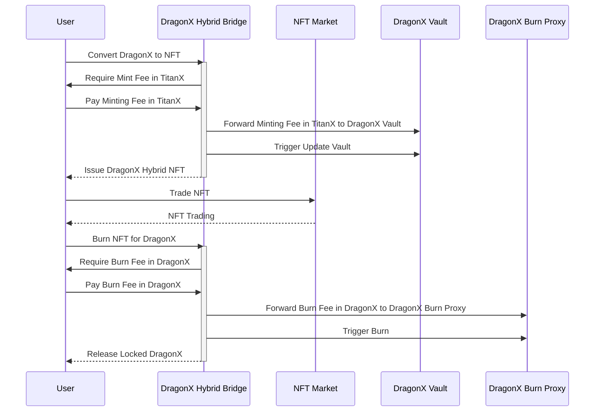

# DragonX Hybrid Architecture

## Overview

This document outlines the architecture of the DragonX Hybrid system, a revolutionary platform combining traditional cryptocurrency trading with NFT technology. It highlights the interactions and requirements of the system components, including the DragonX Hybrid Bridge, the NFT minting and burning process, and the market dynamics.

### Architecture Diagram

### Component Overview

1. **DragonX Hybrid Bridge**:
   - Facilitates the conversion of DragonX tokens into DragonX Hybrid NFTs.
   - Locks DragonX tokens and issues corresponding NFTs.
   - Handles NFT burning and the release of locked DragonX.

2. **DragonX Vault**:
   - Receives TitanX minting fees.
   - Contributes to the compounding mechanism of the DragonX ecosystem.

3. **NFT Market** (e.g., OpenSea):
   - Enables trading of DragonX Hybrid NFTs.
   - Provides liquidity and market accessibility.

4. **User**:
   - Engages in minting, trading, and burning NFTs.
   - Pays minting and burning fees.

5. **DragonX Burn Proxy**:
   - Allows to burn arbitrary amounts of DragonX.
   - Actors can send DragonX to the Burn Proxy, by calling the public burn function, all tokens send to the Burn Proxy are burned and events / statistic variables are updated.

### Process Flow

1. **Minting**:
   - User provides DragonX tokens for NFT creation.
   - A minting fee in TitanX is paid to the DragonX Vault.
   - DragonX Hybrid Bridge issues the NFT, locking the DragonX tokens.

2. **Trading**:
   - User trades the DragonX Hybrid NFT on secondary NFT markets.
   - NFTs represent locked DragonX tokens with added thematic value.

3. **Burning**:
   - User burns the NFT to reclaim the underlying DragonX.
   - A burn fee in DragonX is required.
   - Upon burning, the DragonX tokens are released back to the user.

### Requirements

- **DragonX and TitanX Tokens**: Users must possess DragonX and TitanX tokens to participate in minting and burning processes.
- **NFT Market Access**: Users need access to secondary NFT markets for trading.
